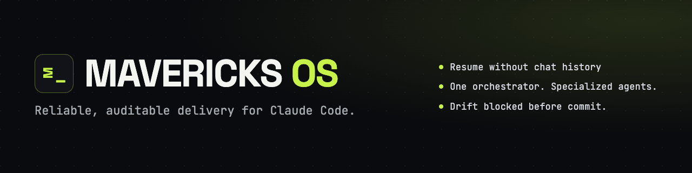

<p align="center">
  
</p>

# Mavericks OS for Claude Code

[](https://github.com/yahor-punko/mavericks-os/actions/workflows/ci.yml)
[](LICENSE)
[](https://nodejs.org/)

Reliable, auditable delivery for Claude Code agents.

Mavericks persists project state across sessions, routes work through
specialised roles, and blocks backlog/task drift before commit.

Built for operators and small teams running agent-driven development
across multiple repositories.

> **323 tasks · 25 waves · 12.5 weeks** — tracked from one central backlog across **10 of the 20 Git repositories** of a live AWS system (**15 active Lambda functions**). Measured through 13 July 2026.

[See it in action](#close-it-come-back-tomorrow) · [Why Mavericks is different](#why-mavericks-is-different) · [Quick start](#quick-start)

## Close it. Come back tomorrow.


*Close Claude Code, come back tomorrow — the wave goal and handoff are handed to you, not reconstructed from chat history.*

Anyone juggling more than one project knows this trap: you close the
laptop mid-thought, get pulled away, and by the next session you're
rebuilding what you were doing from memory or a long scroll of chat
history — both slow, and easy to get wrong. Mavericks writes that down
instead: what was in progress and what to do next live in the project
itself, so the next session opens with a clear starting point, not a
guess. See [Pick up exactly where you left off](#pick-up-exactly-where-you-left-off).

## Three results

- **Close it, come back tomorrow — no state archaeology.** State lives in versioned artifacts; every session resumes from written state, not a chat log. See [Pick up exactly where you left off](#pick-up-exactly-where-you-left-off).
- **Auditable runs.** You can see — and diff — why the system did what it did, because state and decisions live in files, not model memory. See [What actually carries over between sessions](#what-actually-carries-over-between-sessions).
- **Drift caught before commit.** A validator blocks out-of-sync BACKLOG/TASK_STATUS before it reaches a commit. See [A status that isn't written down isn't real](#a-status-that-isnt-written-down-isnt-real).

## Case study: Synth

Synth is a production AWS system of 20 Git repositories and 15 active
Lambda functions. Mavericks ran the operation from a single control
repository whose central backlog declared 10 of those 20 repositories as
task targets — the coordination is production-exercised, not merely
designed, and it comes with the honest caveats of an N=1, no-control-group
observation.

| Metric | Value |
|---|---|
| Repositories in the Synth system | 20 |
| Repositories declared as task targets | 10 |
| Active Lambda functions (live prod) | 15 |
| Tasks reaching merge or beyond | 323 (242 merged + 81 deployed_prod) |
| Multi-repo tasks (target > 1 repo) | 19 |
| Delivery waves | 25 |
| Session checkpoints | 81 |
| Control-repo commits, Mavericks era | 523 (vs 364 baseline) |
| Window | 17 Apr – 13 Jul 2026 (~12.5 weeks) |

This is an observational, N=1 case study — one operator, one control
backlog, no control group — so the numbers show operational continuity and
auditability across a coordinated system, not causal productivity.

[Read the full methodology, findings, and limitations →](docs/case-studies/synth.md)

## Why Mavericks is different

Most agent workflows fall into one of three categories below. Mavericks
overlaps with parts of each, but its shipped combination — versioned state,
a validator gate, specialised roles, and production-exercised multi-repo
coordination — is what the table below is comparing.

| Capability | Ad-hoc prompting | Chat-memory tools | Single-repo task boards | Mavericks |
|---|---|---|---|---|
| Session continuity across restarts | ❌ | ⚠️ recall, not authoritative state | ⚠️ requires manually re-reading the board | ✅ versioned artifacts (`BACKLOG.md`, `TASK_STATUS.md`, `PROCESS_STATE.json`) |
| Auditable, diffable decision history | ❌ | ❌ | ⚠️ issue/comment history, not structured | ✅ state and decisions live in files, diffable in git |
| Automated drift detection before commit | ❌ | ❌ | ❌ | ✅ validator blocks out-of-sync backlog/task state (exit 2) |
| Role-specialised execution & review | ❌ | ❌ | ⚠️ manual assignment | ✅ spec'd sub-agent roles (developer, QA, UX, security, docs, architect…) |
| Multi-repository backlog coordination | ❌ | ❌ | ❌ single repo | ✅ production-exercised — 10 of 20 repos in the Synth case study |

**Legend:** ✅ built-in and shipped · ⚠️ possible, but manual or partial · ❌ not addressed

## Quick start

> **Before you run this:** Mavericks defaults to autonomous tool execution (`bypassPermissions`, no per-action confirmation prompts once a session starts). See **[Security model](#security-model)** below for exactly what that means and how to opt out.

There are two different things you might want to do here — try Mavericks, or adopt it into a project you already have. They're separate steps.

### Try the demo

One command, no follow-up needed:

```bash
curl -fsSL https://raw.githubusercontent.com/yahor-punko/mavericks-os/main/install.sh | sh -s -- --demo
```

This clones Mavericks to `$HOME/.mavericks`, prompts for consent on your terminal (the `bypassPermissions` disclosure — see **[`SECURITY.md`](SECURITY.md)** for exactly what that means and how to opt out), then runs a narrated, throwaway walkthrough of the operator loop against a disposable fixture — no docs required.

To re-run the demo later without reinstalling:

```bash
"$HOME/.mavericks/scripts/mavp-operator" --demo
```

(Use the absolute path above, not a relative `./scripts/mavp-operator` — that only works from inside the Mavericks checkout itself.)

### Add Mavericks to a project

The one-liner above only clones the framework — it does not touch your own project. Adopting Mavericks into a project is a separate step, run against the checkout the demo just created:

```bash
node "$HOME/.mavericks/scripts/mavp-install.js" /path/to/your-project
```

See **Manual install** below (or **[`docs/core/BOOTSTRAP_GUIDE.md`](docs/core/BOOTSTRAP_GUIDE.md)** for the full step-by-step) for what this creates and how to configure it.

### Requirements

- Node.js 20+
- Claude Code CLI (`claude`)
- git

### Manual install

For people who'd rather not `curl | sh`:

### Step 1 — Get Mavericks onto your machine

Clone this repository somewhere on disk, e.g.:

```bash
git clone https://github.com/yahor-punko/mavericks-os.git <path-to-mavericks>
```

Everything below refers to that checkout as `<path-to-mavericks>`.

### Step 2 — Bootstrap a new project

From your own project's directory (or pointing at it):

```bash
node <path-to-mavericks>/scripts/mavp-install.js /path/to/your-project
```

Use `--check` first to preview what would happen without writing anything:

```bash
node <path-to-mavericks>/scripts/mavp-install.js --check /path/to/your-project
```

Runs non-interactively (no prompt) when invoked from an agent's Bash tool or piped/CI, or explicitly via `--yes` / `-y`; at a real terminal without either it still asks `Create N file(s)...? [Y/n]`.

If you ask an agent to install Mavericks from a session where shell access is denied, it can't — run the one command above yourself (terminal, or the `!` prefix in Claude Code). This one-time human step is deliberate: the person running the installer consents to the prompt-free `bypassPermissions` default it configures (see **[`SECURITY.md`](SECURITY.md)**). In prompting permission modes a single approval suffices instead. Later sessions inherit the configured permissions and the agent operates autonomously.

This creates, in `your-project/`:

- `scripts/mavp-operator` — a bash wrapper that delegates to this Mavericks installation
- `scripts/mavp-operator-agent.js` — project-specific session-start summary
- `scripts/mavp-operator-close-session.js` — end-of-session ritual
- `BACKLOG.md`, `TASK_STATUS.md`, `PROCESS_STATE.md`, `PROCESS_STATE.json` — live state artifacts, from templates
- `.claude/agents/*.md`, `.claude/skills/*/SKILL.md`, `.claude/rules/*.md` — sub-agent specs, skills, and rules, copied from this repo
- `.claude/settings.json` / `.claude/settings.local.json` — shared and personal Claude Code settings (see **[Security model](#security-model)** below)

Pass `--transcript-archive` to opt into a gitignored session-transcript archive at `.mavp/transcripts/`, with retention bounded via the `MAVP_TRANSCRIPT_RETENTION_DAYS` env var — off by default. See **[`docs/core/BOOTSTRAP_GUIDE.md`](docs/core/BOOTSTRAP_GUIDE.md)** for details.

Core framework scripts (the operator library, dashboard, validator) are **not copied** into your project — the generated `scripts/mavp-operator` wrapper runs them directly from this Mavericks checkout.

The wrapper resolves the Mavericks install location in this order: an explicit `MAVERICKS_HOME` env var, if set, always wins; otherwise `$HOME/.mavericks` — the canonical default, and where `install.sh` clones Mavericks — is used if it exists; otherwise `$HOME/Documents/mavericks` is used as a legacy fallback. If you cloned Mavericks somewhere else entirely, set `MAVERICKS_HOME` to that path (e.g. in your shell profile or before invoking the wrapper):

```bash
export MAVERICKS_HOME=<path-to-mavericks>
```

The wrapper also exports `MAVERICKS_PROJECT_ROOT` automatically when it runs, pointing framework scripts at *your* project's artifacts rather than the Mavericks checkout itself — you don't need to set this one yourself.

For the full step-by-step, including editing `PROCESS_STATE.json`, adding your first tasks, and setting up the pre-commit validator hook, see **[`docs/core/BOOTSTRAP_GUIDE.md`](docs/core/BOOTSTRAP_GUIDE.md)**.

### Step 3 — Run operator commands (from your bootstrapped project)

```bash
./scripts/mavp-operator --agent          # session-start JSON summary
./scripts/mavp-operator                  # operator dashboard
./scripts/mavp-operator --watch          # dashboard with auto-refresh (r refresh, s snapshot, q quit)
./scripts/mavp-operator --snapshot       # text snapshot for agent context
./scripts/mavp-operator --close-session  # end-of-session ritual (results review + optional git push)
./scripts/mavp-operator --handoff        # capture context for the next session
./scripts/mavp-operator --new-task       # interactive task creation
./scripts/mavp-operator --archive-merged # archive merged tasks mid-wave
./scripts/mavp-operator --version        # framework version
./scripts/mavp-operator --help           # show all flags
```

### Updating Mavericks

Updating is two steps — one for the shared framework checkout, one per project.

**1. Update the framework checkout.** Bootstrapped projects run core scripts directly from the checkout, so this one step updates the framework for every project at once:

```bash
git -C "$HOME/.mavericks" pull --ff-only    # use your <path-to-mavericks> if you cloned elsewhere
```

Re-running the `curl | sh` installer does the same thing — it is idempotent and pulls an existing checkout instead of re-cloning.

**2. Re-sync each bootstrapped project.** The files the installer *copied* into your project (`.claude/` agents, skills, rules, hooks, and the wrapper and project scripts) don't update themselves. From each project's directory:

```bash
./scripts/mavp-operator --install --update .
```

This overwrites the copied framework files with the latest versions and records the new framework version in `PROCESS_STATE.json`. It never touches your task state — `BACKLOG.md`, `TASK_STATUS.md`, and the rest of `PROCESS_STATE.json` are left alone. Pass `--no-hooks` to skip the hooks refresh, or use `--hooks-only` to refresh only the hooks.

You don't need to watch for releases: when a project's recorded framework version falls behind the checkout, the session-start brief prints an `UPDATE_AVAILABLE` notice with the exact re-sync command.

## See more


Drift between `BACKLOG.md` and `TASK_STATUS.md` is caught before it reaches a commit.


One glance at workflow state, context usage, runtime actors, and open waits.

## How it works

### Why Mavericks exists

Mavericks emerged from running agent-driven development across multiple
repositories in parallel, not from a whiteboard exercise.

The recurring failure mode was not code generation; it was continuity:
reconstructing project state at the start of a session and losing the
rationale behind decisions when chat context rolled over.

Mavericks addresses that with versioned, artifact-first state (see [Pick up exactly where you left off](#pick-up-exactly-where-you-left-off) and
[A status that isn't written down isn't real](#a-status-that-isnt-written-down-isnt-real) below); a strict separation between the `main_agent` orchestrator and
specialised execution and review roles; and validation that surfaces
backlog/task-state drift before commit.

Every mechanism in this repository was retained because it solved a
recurring problem in active delivery.

### Pick up exactly where you left off

Losing the thread of a project between sessions is the everyday
failure this framework exists to prevent — not by asking for better
notes, but by having the project keep its own notes and hand them back
automatically.

Every session opens with a short brief, worked out fresh each time,
never from a hand-kept list:

- **What's in flight** — read straight from the task files, so it
  can't quietly go stale.
- **One next action** — a single line telling you what to do next.
- **What changed while you were away** — files touched since the last
  time a session was formally closed, computed from the project's own
  git history, not a guess.
- **A handoff note, when one was left** — mid-thought context, written
  to `HANDOFF.md`, handed back immediately.

For example (illustrative, not a literal transcript) — just two of
the four parts above, the changed-files list and the next action:

```
Must read:
- lambda/handler.py
Next action: T-231 → developer → fix the retry bug
```

`HANDOFF.md` is not written automatically when a session ends. Writing
it is a separate, deliberate step (`--handoff`); closing a session
(`--close-session`) does not do it, and it's single-use — delivered
once at the next session's start, then deleted. The next-action line
itself stays narrow on purpose — one instruction, never a running
commentary; anything longer belongs in the handoff note instead.

### A status that isn't written down isn't real

Telling an agent something is done, and having it actually be done,
are two different things — this section closes that gap. A task's
status changes only when it's written into the project's own task
files, never because someone said so in conversation.

Two files carry that status side by side, and they're required to
agree. A check runs automatically after every edit to either one; it
doesn't stop the edit, it just flags the moment they drift apart, so
the gap is caught immediately instead of days later. The strictest
version of that check sits at the door to history: a task can't be
recorded as fully merged without pointing to the real code change that
shipped it — get that wrong and the record can't be committed. Full
state machine and evidence rules:
[`docs/core/TASK_LIFECYCLE.md`](docs/core/TASK_LIFECYCLE.md).

### What actually carries over between sessions

Closing a chat and starting a new one never loses anything that
matters, because none of it — a task's status, its history, a
decision made along the way — ever lived in an agent's memory to begin
with; all of it lives in the files described above. Every specialised
agent doing a piece of work is briefed fresh from those same files
each time, with no memory of its own carried in from a previous run.

What does travel forward isn't a fact about any one task — it's
practice: lessons about what tends to go wrong, folded back into the
written instructions those agents read next time, only after a person
has reviewed and approved the change. There is no separate memory
store behind any of this — the files are the only place state lives.

### Cross-repo coordination

Mavericks runs a **direct-reference model**: one framework checkout serves
many projects, and state is never replicated per repository. A single
control repo holds the one `BACKLOG.md`, `TASK_STATUS.md`, and
`PROCESS_STATE.json`; every sibling repository's `scripts/mavp-operator`
wrapper delegates back to that one checkout via `MAVERICKS_PROJECT_ROOT`
rather than carrying its own copy of these files.

Cross-repo tasks declare a `Repos:` field in the backlog (e.g.
`- **Repos:** repo-a, repo-b`). When a sub-agent completes work in a
sibling repository, its evidence is recorded back into the control repo's
`TASK_STATUS.md` as one line per repo — `commit: <hash> (repo-a)`,
`commit: <hash> (repo-b)` — so the control backlog stays the single,
auditable source of truth for *where* work landed even though the diffs
live in the sibling repositories. Before dispatching a cross-repo task, the
main agent runs the cross-repo pre-flight described in
[`docs/core/ORCHESTRATION_RULES.md`](docs/core/ORCHESTRATION_RULES.md);
`./scripts/mavp-operator --check-sync` compares agent/skill files across
known projects against the Mavericks source to catch drift between them.

Cross-repo *ordering* is enforced, not just recorded: a task may declare
`- **Blocked by:** <repo>/T-NNN` (comma-separated for multiple references;
distinct from the same-repo `Depends on:` field). The validator resolves
`<repo>` to a local working copy via the repo-map registry
([`docs/REPO_MAP.md`](docs/REPO_MAP.md)) and reads the blocker task's status
from that repo's own artifacts: a task promoted to `merged` or `qa_passed`
while its blocker is not yet `merged` is a blocking failure (exit 2), a task
at `ready_for_qa` gets a warning, and an unresolvable reference (unknown repo
id or missing blocker task) surfaces as an info-level advisory rather than a
block.

This is production-exercised, not a design sketch: 10 of the Synth case
study's 20 repositories were declared as task targets from the one control
backlog, with 19 tasks explicitly targeting more than one repository (see
[Case study: Synth](#case-study-synth)).

```
                   ┌──────────────────────────────────┐
                   │     control repo (mavericks)     │
                   │  BACKLOG.md · TASK_STATUS.md ·   │
                   │ PROCESS_STATE.json (single copy) │
                   └──────────────────────────────────┘
                                     │
                          main_agent orchestrator
                                     │
                 task carries `Repo: repo-a, repo-b, ...`
                                     │
       ┌───────────────────┬─────────┴─────────┬───────────────────┐
       ▼                   ▼                   ▼                   ▼
sibling repo A      sibling repo B      sibling repo C      sibling repo N
  (sub-agent          (sub-agent          (sub-agent          (sub-agent
 commits code)       commits code)       commits code)       commits code)
       │                   │                   │                   │
       └───────────────────┴─────────┬─────────┴───────────────────┘
                                     ▼
                  evidence recorded back to control repo:
        `commit: <hash> (repo-a)` · `commit: <hash> (repo-b)` · ...
                                     │
                                     ▼
                  validator · QA · security review gates
                                     │
                                     ▼
                    AWS deployment (15 active Lambdas)
```

## Project artifacts

For why these files are treated as the truth rather than notes about
it, see [A status that isn't written down isn't real](#a-status-that-isnt-written-down-isnt-real) above.

| File | Purpose |
|---|---|
| `BACKLOG.md` | All tasks — status, owner, dependencies, acceptance criteria |
| `TASK_STATUS.md` | Active tasks detail + recently completed |
| `PROCESS_STATE.md` | Current initiative, stage, blockers, next handoff (auto-generated from `PROCESS_STATE.json`) |
| `PROCESS_STATE.json` | Machine-readable state overlay for operator tools |

## Task lifecycle

```
planned → in_progress → dev_done → [ux_review →] ready_for_qa → qa_passed → merged → [runtime_verified] → [deployed_dev →] [deployed_prod]
```

With UX review (task sets `requires_ux: true`):

```
dev_done → ux_review → ux_passed → ready_for_qa → ...
                     ↘ ux_needs_fix → developer
```

With security review (task sets `requires_security_review: true`):

```
dev_done → security_review → security_passed → ready_for_qa → ...
                            ↘ security_needs_fix → developer
```

Deploy statuses (`deployed_dev`, `deployed_prod`) are optional — projects without an explicit deploy pipeline stay on `merged` as their final state. See **[`docs/core/TASK_LIFECYCLE.md`](docs/core/TASK_LIFECYCLE.md)** for the full state machine, verification types, and evidence rules.

## Roles

Every sub-agent role has a spec in [`.claude/agents/`](.claude/agents/) — pass the relevant file to the sub-agent as context when spawning it. The main orchestrator agent (plans, coordinates, accepts/rejects sub-agent work, drives momentum) does not have its own spec file — it *is* the session you're running, on the `opus` alias (resolves to the latest Opus generation).

| Role | Responsibility | Model | Prompt |
|---|---|---|---|
| **Developer** | Narrow, self-contained implementation slices | Sonnet (→ Opus for complex slices) | [`.claude/agents/developer.md`](.claude/agents/developer.md) |
| **QA** | Functional validation against acceptance criteria — `qa_passed` or `needs_fix` | Sonnet (→ Opus for complex slices) | [`.claude/agents/qa.md`](.claude/agents/qa.md) |
| **UX** | Flows, microcopy, feedback states, accessibility — `ux_passed` or `ux_needs_fix` (optional per task) | Sonnet (→ Opus for complex slices) | [`.claude/agents/ux.md`](.claude/agents/ux.md) |
| **Security reviewer** | Security review for new inputs/outputs, auth flows, integrations — `security_passed` or `security_needs_fix` (optional per task) | Sonnet (→ Opus for a full, non-checklist review) | [`.claude/agents/security-reviewer.md`](.claude/agents/security-reviewer.md) |
| **Product/docs** | Backlog clarity, process docs, artifact sync | Sonnet (→ Opus for complex slices) | [`.claude/agents/product-docs.md`](.claude/agents/product-docs.md) |
| **Technical writer** | User-facing docs — README, getting-started guides, API reference, changelog | Sonnet (→ Opus for complex slices) | [`.claude/agents/technical-writer.md`](.claude/agents/technical-writer.md) |
| **Architect** | Pre-task design brief and task decomposition (mandatory gate for every task, sole exception the XS fast lane — see [`docs/core/ORCHESTRATION_RULES.md`](docs/core/ORCHESTRATION_RULES.md)) | Fable 5 (primary) → Opus (fallback) | [`.claude/agents/architect.md`](.claude/agents/architect.md) |
| **Analyst** | External technology and landscape research, ahead of architect review | Sonnet (→ Opus for complex slices) | [`.claude/agents/analyst.md`](.claude/agents/analyst.md) |
| **Frontend design** | Visual/interaction design for frontend surfaces | Sonnet (→ Opus for complex slices) | [`.claude/agents/frontend-design.md`](.claude/agents/frontend-design.md) |
| **UI designer** | UI component and layout design | Sonnet (→ Opus for complex slices) | [`.claude/agents/ui-designer.md`](.claude/agents/ui-designer.md) |
| **Exa researcher** | Web research via the Exa search tool | Sonnet (→ Opus for complex slices) | [`.claude/agents/exa-researcher.md`](.claude/agents/exa-researcher.md) |

Model and effort selection policy (including the exact escalation signals) lives in [`docs/AGENT_SPEC.md`](docs/AGENT_SPEC.md) — "Model selection" — the single source of truth.

## Validator

```bash
node scripts/mavp-validator.js
```

Exit codes: `0` healthy · `1` drifting · `2` repair required (blocks commit via the pre-commit hook)

Run after every `BACKLOG.md` or `TASK_STATUS.md` change. The pre-commit hook at `.claude/hooks/pre-commit` runs it automatically on every `git commit` once wired up (see `docs/core/BOOTSTRAP_GUIDE.md` — "Pre-commit hook").

## Security model

Mavericks ships with autonomous tool execution enabled by default (`permissions.defaultMode: "bypassPermissions"` in the committed `.claude/settings.json`). This means agents can read, write, and execute across your filesystem and shell without a per-action confirmation prompt once you start a session. This is deliberate — see **[`SECURITY.md`](SECURITY.md)** for exactly what it means, how to opt out before your first session, and how to report a vulnerability.

Mavericks is not a deliverable product you run in production — it's a reusable framework that other projects **adopt** into their own repository.

## Core docs

All in [`docs/core/`](docs/core/):

| Doc | What it covers |
|---|---|
| [`ROLES.md`](docs/core/ROLES.md) | Role definitions |
| [`TASK_LIFECYCLE.md`](docs/core/TASK_LIFECYCLE.md) | Full task state machine |
| [`ORCHESTRATION_RULES.md`](docs/core/ORCHESTRATION_RULES.md) | Main agent coordination rules |
| [`APPROVALS_AND_BLOCKERS.md`](docs/core/APPROVALS_AND_BLOCKERS.md) | Blocker format and silence rule |
| [`QA_HANDOFF.md`](docs/core/QA_HANDOFF.md) | QA handoff protocol |
| [`BOOTSTRAP_GUIDE.md`](docs/core/BOOTSTRAP_GUIDE.md) | Step-by-step new project setup |
| [`NEW_PROJECT_CHECKLIST.md`](docs/core/NEW_PROJECT_CHECKLIST.md) | Bootstrap checklist |
| [`OPERATOR_DASHBOARD.md`](docs/core/OPERATOR_DASHBOARD.md) | Operator dashboard panel reference |
| [`DOC_SYNC.md`](docs/core/DOC_SYNC.md) | Doc-sync advisory (post-merge doc-update reminders) |
| [`DECISIONS.md`](docs/core/DECISIONS.md) | Framework decision records (`DR-NNN`) with greppable lineage fields (`Informed by:` / `Supersedes:` / `Tasks:` / `Session:`) |
| [`RCA_CODIFICATION.md`](docs/core/RCA_CODIFICATION.md) | RCA-to-codification — every root-cause analysis must route each root cause to exactly one durable fix mechanism, with a tracked follow-up task |
| [`SECRET_LEAK_RESPONSE.md`](docs/core/SECRET_LEAK_RESPONSE.md) | Post-publish secret-leak response runbook |

## Contributing

See **[`CONTRIBUTING.md`](CONTRIBUTING.md)** for how work moves through this repository and how to propose a change as an external contributor. Participation is governed by the **[Contributor Covenant](CODE_OF_CONDUCT.md)**.

## License

Mavericks is licensed under the [MIT License](LICENSE). It vendors one third-party component (the `frontend-design` skill, Apache-2.0) — see **[`NOTICE`](NOTICE)** for the full attribution and carve-out.
