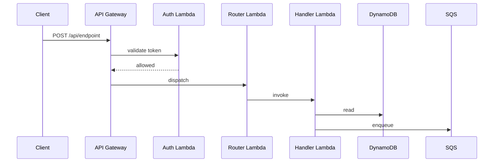

<!-- Overview / index file.
     Switch to federated layout when this file exceeds ~150 lines OR any single service/module section
     exceeds ~50 lines. This applies regardless of repo count — a monorepo or a legacy codebase with many
     modules follows the same rule. Move per-service detail (env vars, queues, tables, metrics) to
     docs/architecture/<service-name>.md and keep this file as the system overview (~100 lines).
     See docs/ARCHITECTURE_GUIDE.md §9 for the full federated layout guide.
-->

# Architecture — [Project Name]

> Last updated: YYYY-MM-DD  
> Mavericks wave: N  
> Coverage: DRAFT | PARTIAL | COMPLETE

---

## Overview

One-paragraph summary of what this project does and who uses it.

---

## Services and components

List every independently deployable unit. For each:

| Component | Type | Language / Runtime | Repo path | Description |
|---|---|---|---|---|
| `component-name` | Lambda / API / Worker / SPA / CLI / ... | Python 3.12 / Node.js 20 / ... | `lambda/handler_name/` | One-line description |

---

## Deploy contours

Environments this project has, how code reaches each one, and what differs between them.

| Contour | Branch | Trigger | URL / endpoint |
|---|---|---|---|
| dev | `develop` | push | https://dev.example.com |
| prod | `main` | push | https://example.com |

---

## Inter-service integrations

How this project's components communicate with each other and with external systems.

### Internal communication

```
ComponentA → [SQS queue: queue-name] → ComponentB
ComponentA → [DynamoDB: table-name] → ComponentC (reads)
```

### External dependencies

> DRAFT — to be completed in Wave N

| Dependency | Type | Direction | Purpose |
|---|---|---|---|
| [external-service] | HTTP API | outbound | [purpose] |

---

## Data flows

> DRAFT — to be completed in Wave N

Key request paths through the system, written as numbered steps or ASCII diagrams.

### Flow: [Name of flow]

```
1. Client sends POST /api/endpoint
2. API Gateway authenticates via Lambda Authorizer
3. Router Lambda dispatches to handler
4. Handler reads from DynamoDB table-name
5. Handler writes result to SQS queue-name
6. Worker Lambda processes queue message
7. Response returned to client
```

Mermaid alternative (optional):



---

## Infrastructure components

> DRAFT — to be completed in Wave N

All cloud or infrastructure resources this project provisions or depends on.

| Resource | Type | Name / ARN pattern | Purpose |
|---|---|---|---|
| `[table-name]` | DynamoDB table | `[table-name]` | [purpose] |
| `[queue-name]` | SQS queue | `[queue-name]` | [purpose] |

---

## Configuration and secrets

> DRAFT — to be completed in Wave N

Environment variables, SSM parameters, or secrets manager paths this project requires. Do not write actual values here.

| Key | Source | Scope | Purpose |
|---|---|---|---|
| `CONFIG_KEY` | AWS Secrets Manager | prod only | [purpose] |
| `BOT_TOKEN` | SSM Parameter Store | all contours | [purpose] |
| `TABLE_PREFIX` | Lambda env var | all contours | [purpose] |

---

## Key design decisions

> DRAFT — to be completed in Wave N

Record non-obvious architectural choices so future maintainers understand why the system is built the way it is.

| Decision | Alternatives considered | Reason chosen |
|---|---|---|
| [decision] | [alternatives] | [reason] |

---

## Known gaps and future work

- [ ] Section "Inter-service integrations" — complete in Wave N
- [ ] Section "Data flows" — complete in Wave N
- [ ] Section "Infrastructure components" — complete in Wave N
- [ ] Section "Configuration and secrets" — complete in Wave N
- [ ] Section "Key design decisions" — complete in Wave N

---

<!-- Per-service detail template (federated layout).
     When this file exceeds ~150 lines or any single service/module section exceeds ~50 lines, create
     docs/architecture/<service-name>.md for each service using the template below.
     Remove per-service detail from this file and replace each entry with a one-line catalog
     row + link. See docs/ARCHITECTURE_GUIDE.md §9 for the full splitting guide.
-->

## Per-service detail template — `docs/architecture/SERVICE_NAME.md`

> Note: Copy the fenced block below into `docs/architecture/<service-name>.md` for each service when switching to federated layout. One file per service. Delete this section from the overview file after the split.

```markdown
# [Service Name] — Architecture Detail

> Last updated: YYYY-MM-DD
> Mavericks wave: N

## Service identity

| Field | Value |
|---|---|
| Name | `service-name` |
| Repo | `repo-name` or `lambda/handler_name/` |
| Runtime | Python 3.12 / Node.js 20 / ... |
| Type | Lambda / API / Worker / SPA / CLI / ... |

## Environment variables

| Key | Source | Scope | Purpose |
|---|---|---|---|
| `ENV_VAR_NAME` | Lambda env var / SSM / Secrets Manager | all / prod only | [purpose] |

## Queues and topics

| Name | Type | Direction | Paired service |
|---|---|---|---|
| `queue-name` | SQS | inbound | [producer service] |

## Tables

| Name | Type | Access pattern |
|---|---|---|
| `table-name` | DynamoDB | read by key: `pk` |

## CloudWatch metrics and alarms

| Metric / Alarm | Namespace | Purpose |
|---|---|---|
| `ErrorCount` | `[project]/[service]` | Alerts on Lambda errors |

## Key dependencies

- [DependencyName] — [why it is needed]

## Known gaps

- [ ] [anything not yet documented]
```
